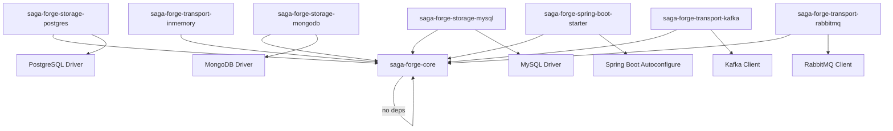
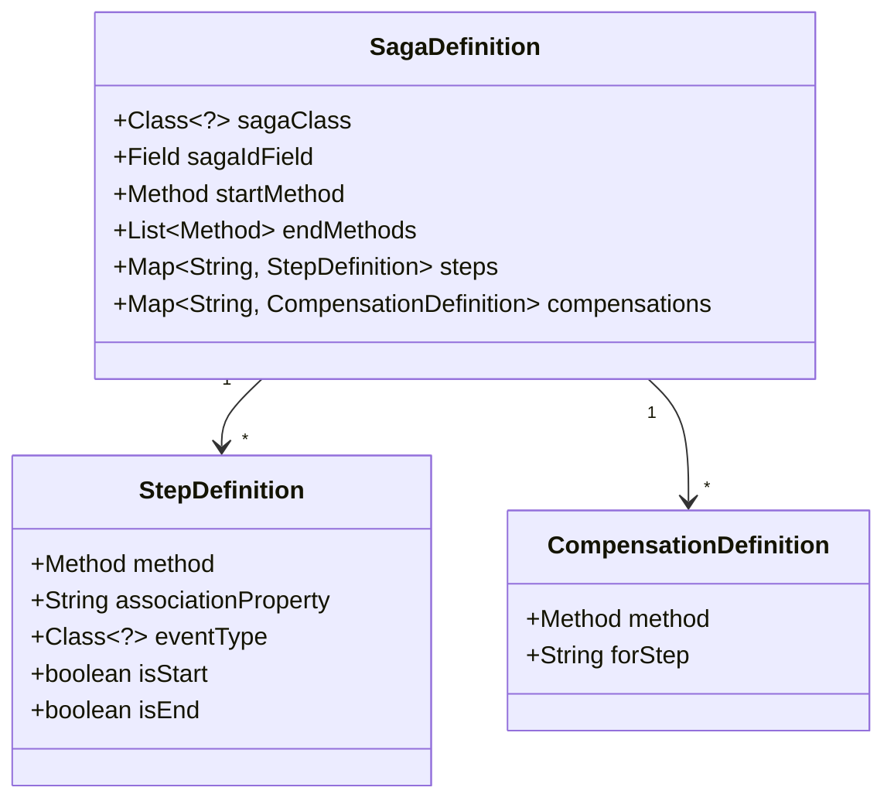

# Design Document: Saga Forge Framework

## Overview

This design covers the foundational layer of Saga Forge: the annotation definitions, multi-module Maven project structure, module dependency boundaries, core interfaces/contracts, and an example saga demonstrating the programming model.

The framework follows an annotation-driven, declarative approach inspired by Axon Framework's saga model. Developers declare sagas as plain Java classes annotated with `@Saga`, define lifecycle boundaries with `@StartSaga`/`@EndSaga`, correlate events to saga instances via `@SagaStep(associationProperty = "...")`, and wire compensation logic with `@SagaCompensation(forStep = "...")`. Domain events and commands are marked with `@DomainEvent` and `@Command` marker annotations respectively, establishing the event-to-command flow pattern.

**What is in scope:**
- All 8 annotation definitions (`@Saga`, `@SagaId`, `@StartSaga`, `@EndSaga`, `@SagaStep`, `@SagaCompensation`, `@DomainEvent`, `@Command`)
- `AnnotationScanner` interface and a reflection-based validation implementation
- Multi-module Maven project structure with parent POM and 5 child modules
- `StorageProvider` and `EventDispatcher` SPI interfaces (contracts only)
- `OrderProcessingSaga` example with domain events and commands

**What is out of scope:**
- Saga engine runtime implementation
- Storage provider implementations (Postgres, MongoDB, MySQL)
- Event transport implementations (in-memory, Kafka, RabbitMQ)
- Spring Boot auto-configuration internals
- Actual pub/sub event delivery implementation

**Key design decisions:**
- Java 24 minimum, leveraging records for immutable event/command types
- All annotations live in `saga-forge-core` with zero external dependencies
- SPI interfaces use Java's `ServiceLoader` pattern for pluggability
- Annotation validation is separated from runtime execution — the `AnnotationScanner` validates at startup, the engine (future spec) executes at runtime

## Architecture

### Module Dependency Graph



Event transport modules follow the same pluggable pattern as storage modules: each depends only on `saga-forge-core` and the respective transport client library. The `saga-forge-transport-inmemory` module has no external dependencies beyond core.

### Package Layout

```
saga-forge/
├── pom.xml                              (parent POM, Java 24, module list)
├── saga-forge-core/
│   ├── pom.xml                          (zero external deps)
│   └── src/main/java/io/github/gkosharovdev/sagaforge/
│       ├── core/
│       │   ├── annotation/              (all 8 annotations)
│       │   │   ├── Saga.java
│       │   │   ├── SagaId.java
│       │   │   ├── StartSaga.java
│       │   │   ├── EndSaga.java
│       │   │   ├── SagaStep.java
│       │   │   ├── SagaCompensation.java
│       │   │   ├── DomainEvent.java
│       │   │   └── Command.java
│       │   ├── scanner/                 (annotation validation)
│       │   │   ├── AnnotationScanner.java        (interface)
│       │   │   ├── SagaValidationResult.java     (validation result)
│       │   │   └── ReflectiveAnnotationScanner.java (implementation)
│       │   └── spi/                     (contracts for future modules)
│       │       ├── StorageProvider.java
│       │       ├── EventDispatcher.java
│       │       └── SagaInstance.java
│       └── test/java/...               (unit + property tests)
├── saga-forge-storage-postgres/
│   ├── pom.xml                          (depends: core + pg driver)
│   └── src/main/java/...               (future spec)
├── saga-forge-storage-mongodb/
│   ├── pom.xml                          (depends: core + mongo driver)
│   └── src/main/java/...               (future spec)
├── saga-forge-storage-mysql/
│   ├── pom.xml                          (depends: core + mysql driver)
│   └── src/main/java/...               (future spec)
├── saga-forge-spring-boot-starter/
│   ├── pom.xml                          (depends: core + spring-boot-autoconfigure)
│   └── src/main/java/...               (future spec)
└── saga-forge-example/
    ├── pom.xml                          (depends: core)
    └── src/main/java/io/github/gkosharovdev/sagaforge/example/
        ├── OrderProcessingSaga.java
        ├── events/
        │   ├── OrderCreatedEvent.java
        │   ├── PaymentProcessedEvent.java
        │   └── OrderCompletedEvent.java
        └── commands/
            ├── ProcessPaymentCommand.java
            ├── ReserveStockCommand.java
            └── RequestDeliveryCommand.java
```

### Design Rationale

1. **Annotations in core, zero deps**: The `saga-forge-core` module has no transitive dependencies. Consumers who only need annotations (e.g., for compile-time checking) pull in nothing extra. This follows the Effective Java principle of minimizing dependencies.

2. **SPI interfaces over abstract classes**: `StorageProvider` and `EventDispatcher` are interfaces, not abstract classes. This allows storage modules to extend database-specific base classes while implementing the SPI contract. Follows Interface Segregation (SOLID).

3. **Validation separated from execution**: The `AnnotationScanner` validates annotation correctness at startup (this spec). The saga engine executes sagas at runtime (future spec). This separation follows Single Responsibility (SOLID) and makes the scanner independently testable.

4. **Records for events and commands**: Java records are ideal for `@DomainEvent` and `@Command` types — they're immutable, have built-in `equals`/`hashCode`, and clearly communicate value semantics.

5. **Example module as a separate Maven module**: The `saga-forge-example` module depends only on `saga-forge-core` and serves as both documentation and a compile-time validation that the annotation model works end-to-end.

6. **EventDispatcher is transport-agnostic (locality decoupling)**: The `EventDispatcher` SPI makes zero assumptions about whether the event publisher and the target saga instance are co-located in the same JVM. This is a deliberate architectural decision. In a single-instance deployment, an in-memory `EventDispatcher` implementation routes events directly via method invocation. In a distributed deployment, a broker-backed implementation (Kafka, RabbitMQ) serializes the domain event, publishes it to a topic/queue, and a consumer on the instance hosting the target saga deserializes and delivers it. The SPI contract is identical in both cases — only the transport changes. This mirrors how `StorageProvider` decouples persistence from the storage backend. Concrete transport implementations (`saga-forge-transport-inmemory`, `saga-forge-transport-kafka`, `saga-forge-transport-rabbitmq`) are separate modules addressed in future specs.

## Components and Interfaces

### Annotations

All annotations reside in `io.github.gkosharovdev.sagaforge.core.annotation`.

#### @Saga
```java
@Target(ElementType.TYPE)
@Retention(RetentionPolicy.RUNTIME)
@Documented
public @interface Saga {
}
```
Marks a class as a saga definition. Only concrete classes (not interfaces or abstract classes) are valid targets. The `AnnotationScanner` enforces this constraint.

#### @SagaId
```java
@Target(ElementType.FIELD)
@Retention(RetentionPolicy.RUNTIME)
@Documented
public @interface SagaId {
}
```
Marks exactly one `String` field per `@Saga` class as the saga instance identity. The scanner validates cardinality (exactly one) and type (`String`).

#### @StartSaga
```java
@Target(ElementType.METHOD)
@Retention(RetentionPolicy.RUNTIME)
@Documented
public @interface StartSaga {
}
```
Marks the method that creates a new saga instance. Must co-occur with `@SagaStep`. Exactly one per saga class.

#### @EndSaga
```java
@Target(ElementType.METHOD)
@Retention(RetentionPolicy.RUNTIME)
@Documented
public @interface EndSaga {
}
```
Marks a method that terminates a saga instance. Must co-occur with `@SagaStep`. At least one per saga class.

#### @SagaStep
```java
@Target(ElementType.METHOD)
@Retention(RetentionPolicy.RUNTIME)
@Documented
public @interface SagaStep {
    String associationProperty();
}
```
Marks an event-handling method. The `associationProperty` names the field on the incoming `@DomainEvent` class used to correlate the event to the correct saga instance. The method must accept exactly one parameter whose type is annotated with `@DomainEvent`.

#### @SagaCompensation
```java
@Target(ElementType.METHOD)
@Retention(RetentionPolicy.RUNTIME)
@Documented
public @interface SagaCompensation {
    String forStep();
}
```
Marks a compensation handler. The `forStep` attribute references the method name of the `@SagaStep` to compensate. The scanner validates that the referenced method exists and is annotated with `@SagaStep`.

#### @DomainEvent
```java
@Target(ElementType.TYPE)
@Retention(RetentionPolicy.RUNTIME)
@Documented
public @interface DomainEvent {
}
```
Marker annotation for domain event classes. The scanner validates that `@SagaStep` method parameters are annotated with this.

#### @Command
```java
@Target(ElementType.TYPE)
@Retention(RetentionPolicy.RUNTIME)
@Documented
public @interface Command {
}
```
Marker annotation for command classes emitted by saga steps.

### AnnotationScanner Interface

```java
package io.github.gkosharovdev.sagaforge.core.scanner;

/**
 * Validates saga class definitions against the annotation model rules.
 * Implementations discover and validate @Saga-annotated classes at startup.
 */
public interface AnnotationScanner {

    /**
     * Validates a single saga class against all annotation rules.
     *
     * @param sagaClass the class annotated with @Saga
     * @return validation result containing any errors found
     * @throws IllegalArgumentException if sagaClass is null
     */
    SagaValidationResult validate(Class<?> sagaClass);
}
```

### SagaValidationResult

```java
package io.github.gkosharovdev.sagaforge.core.scanner;

import java.util.List;

/**
 * Immutable result of validating a @Saga-annotated class.
 *
 * @param sagaClass  the validated class
 * @param errors     list of validation error messages (empty if valid)
 */
public record SagaValidationResult(
    Class<?> sagaClass,
    List<String> errors
) {
    public SagaValidationResult {
        errors = List.copyOf(errors);
    }

    public boolean isValid() {
        return errors.isEmpty();
    }
}
```

### ReflectiveAnnotationScanner

The concrete implementation uses Java reflection to validate all annotation rules:

**Validation rules enforced (mapped to requirements):**

| Rule | Requirement | Description |
|------|-------------|-------------|
| R1 | 1.3, 1.4 | Class must be annotated with `@Saga`, must be concrete (not interface/abstract) |
| R2 | 2.3, 2.4 | Exactly one `@SagaId` field of type `String` |
| R3 | 3.3, 3.4 | Exactly one `@StartSaga` method, at least one `@EndSaga` method |
| R4 | 3.5, 3.6, 3.7 | `@StartSaga`/`@EndSaga` methods must also have `@SagaStep` |
| R5 | 4.4, 4.5, 4.6 | `@SagaStep` methods: exactly one param, param type annotated with `@DomainEvent` |
| R6 | 5.4, 5.5 | `@SagaCompensation.forStep` references existing `@SagaStep` method |

```java
package io.github.gkosharovdev.sagaforge.core.scanner;

import io.github.gkosharovdev.sagaforge.core.annotation.*;
import java.lang.reflect.*;
import java.util.*;

public class ReflectiveAnnotationScanner implements AnnotationScanner {

    @Override
    public SagaValidationResult validate(Class<?> sagaClass) {
        Objects.requireNonNull(sagaClass, "sagaClass must not be null");
        List<String> errors = new ArrayList<>();

        validateClassLevel(sagaClass, errors);
        validateSagaIdField(sagaClass, errors);
        Map<String, Method> stepMethods = validateSagaSteps(sagaClass, errors);
        validateLifecycle(sagaClass, errors);
        validateCompensation(sagaClass, stepMethods, errors);

        return new SagaValidationResult(sagaClass, errors);
    }

    // Each private method validates one rule group.
    // Implementation details follow the validation rules table above.
}
```

### SPI Interfaces (Contracts Only)

These interfaces define the contracts that storage and event transport modules will implement in future specs. Both `StorageProvider` and `EventDispatcher` follow the same pluggable module pattern: the SPI is defined in `saga-forge-core`, and concrete implementations live in separate modules.

#### StorageProvider
```java
package io.github.gkosharovdev.sagaforge.core.spi;

import java.util.Optional;

/**
 * SPI for durable saga instance persistence.
 * Implementations are provided by storage modules (postgres, mongodb, mysql).
 */
public interface StorageProvider {

    void save(SagaInstance instance);

    Optional<SagaInstance> findById(String sagaId);

    List<SagaInstance> findByAssociation(String associationProperty, String associationValue);

    void delete(String sagaId);
}
```

#### EventDispatcher
```java
package io.github.gkosharovdev.sagaforge.core.spi;

/**
 * SPI for pub/sub event delivery to saga instances.
 *
 * <p>This interface is <strong>transport-agnostic</strong>. It makes no assumptions about
 * whether the event publisher and the target saga instance reside in the same JVM process.
 * Implementations may deliver events in-process (e.g., direct method invocation for
 * single-instance deployments) or across instances via a message broker (e.g., Kafka,
 * RabbitMQ for distributed deployments).</p>
 *
 * <h3>Implementor concerns</h3>
 * <ul>
 *   <li><strong>Serialization</strong>: Distributed implementations must handle serialization
 *       and deserialization of domain event objects for cross-instance transport.</li>
 *   <li><strong>Event routing</strong>: Implementations must route events to the correct saga
 *       instance based on association property correlation, regardless of which application
 *       instance hosts that saga.</li>
 *   <li><strong>Delivery semantics</strong>: Implementations should document their delivery
 *       guarantees (at-least-once, exactly-once). The SPI does not prescribe a specific
 *       delivery semantic — this is a transport-level concern.</li>
 * </ul>
 */
public interface EventDispatcher {

    void dispatch(Object domainEvent);

    void registerSagaType(Class<?> sagaClass);
}
```

#### SagaInstance
```java
package io.github.gkosharovdev.sagaforge.core.spi;

import java.time.Instant;
import java.util.Map;

/**
 * Represents a running saga instance's persisted state.
 *
 * @param sagaId           unique identifier
 * @param sagaType         fully qualified class name of the @Saga class
 * @param state            serialized saga field state
 * @param associations     association property -> value mappings
 * @param status           current lifecycle status
 * @param createdAt        creation timestamp
 * @param lastModifiedAt   last state transition timestamp
 */
public record SagaInstance(
    String sagaId,
    String sagaType,
    Map<String, Object> state,
    Map<String, String> associations,
    SagaStatus status,
    Instant createdAt,
    Instant lastModifiedAt
) {
    public SagaInstance {
        state = Map.copyOf(state);
        associations = Map.copyOf(associations);
    }
}
```

#### SagaStatus
```java
package io.github.gkosharovdev.sagaforge.core.spi;

public enum SagaStatus {
    CREATED,
    RUNNING,
    COMPENSATING,
    COMPLETED,
    FAILED
}
```

## Data Models

### Annotation Metadata (Internal to Scanner)

The `ReflectiveAnnotationScanner` builds an internal model during validation. This model is not persisted — it exists only during the validation pass.



This internal model is a natural byproduct of validation. Future specs (saga engine) can reuse it for runtime dispatch, but that's out of scope here.

### SagaInstance Persistence Model

The `SagaInstance` record (defined in the SPI section above) is the persistence contract. Storage providers serialize/deserialize this record. Key fields:

- `sagaId` — the value from the `@SagaId` field, used as the primary key
- `sagaType` — FQCN of the `@Saga` class, used for deserialization
- `state` — a `Map<String, Object>` snapshot of all saga fields (serialized by the engine)
- `associations` — maps `associationProperty` names to their current values, used for event correlation lookups
- `status` — lifecycle state tracked via `SagaStatus` enum
- `createdAt` / `lastModifiedAt` — timestamps for auditing and ordering


## Correctness Properties

*A property is a characteristic or behavior that should hold true across all valid executions of a system — essentially, a formal statement about what the system should do. Properties serve as the bridge between human-readable specifications and machine-verifiable correctness guarantees.*

### Property 1: SagaId cardinality enforcement

*For any* `@Saga`-annotated class, the `AnnotationScanner` shall report a validation error if and only if the class does not contain exactly one `@SagaId`-annotated field of type `String`. Equivalently: for any saga class with zero, or two or more `@SagaId` fields, or a `@SagaId` field of non-`String` type, `validate()` must return a result where `isValid()` is `false` and `errors` contains a message about `@SagaId`.

**Validates: Requirements 2.3, 2.4**

### Property 2: Lifecycle method cardinality enforcement

*For any* `@Saga`-annotated class, the `AnnotationScanner` shall report a validation error if the class does not contain exactly one `@StartSaga`-annotated method or does not contain at least one `@EndSaga`-annotated method. For any saga class violating either cardinality constraint, `validate()` must return `isValid() == false`.

**Validates: Requirements 3.3, 3.4**

### Property 3: Lifecycle annotations require @SagaStep co-occurrence

*For any* method annotated with `@StartSaga` or `@EndSaga` within a `@Saga`-annotated class, if that method is not also annotated with `@SagaStep`, then the `AnnotationScanner` shall report a validation error. Conversely, if all lifecycle-annotated methods also carry `@SagaStep`, this rule produces no errors.

**Validates: Requirements 3.5, 3.6, 3.7**

### Property 4: SagaStep parameter validation

*For any* `@SagaStep`-annotated method within a `@Saga`-annotated class, the `AnnotationScanner` shall report a validation error if the method does not accept exactly one parameter, or if that parameter's type is not annotated with `@DomainEvent`. For any saga class where all `@SagaStep` methods have exactly one `@DomainEvent`-annotated parameter, this rule produces no errors.

**Validates: Requirements 4.4, 4.5, 4.6**

### Property 5: SagaCompensation forStep reference validity

*For any* `@SagaCompensation`-annotated method within a `@Saga`-annotated class, the `AnnotationScanner` shall report a validation error if the `forStep` attribute references a method name that either does not exist in the class or exists but is not annotated with `@SagaStep`. For any saga class where all `@SagaCompensation.forStep` values reference valid `@SagaStep` method names, this rule produces no errors.

**Validates: Requirements 5.4, 5.5**

### Property 6: Valid saga classes pass validation

*For any* `@Saga`-annotated class that satisfies all structural rules (concrete class, exactly one `@SagaId` String field, exactly one `@StartSaga` method, at least one `@EndSaga` method, all lifecycle methods co-annotated with `@SagaStep`, all `@SagaStep` methods with exactly one `@DomainEvent` parameter, all `@SagaCompensation.forStep` referencing valid `@SagaStep` methods), the `AnnotationScanner.validate()` shall return a `SagaValidationResult` where `isValid()` is `true` and `errors` is empty.

**Validates: Requirements 1.3, 2.3, 3.3, 3.4, 3.5, 3.6, 4.4, 5.4, 5.5**

### Property 7: Non-concrete saga classes are rejected

*For any* class annotated with `@Saga` that is an interface or an abstract class, the `AnnotationScanner` shall report a validation error. `validate()` must return `isValid() == false` with an error message indicating the class must be concrete.

**Validates: Requirements 1.4**

### Property 8: SagaValidationResult immutability

*For any* `SagaValidationResult` instance, the `errors` list shall be unmodifiable. Attempting to mutate the list (add, remove, clear) shall throw `UnsupportedOperationException`. This holds regardless of the input list passed to the constructor.

**Validates: Requirements 1.3, 2.3 (general correctness — validation results must be trustworthy and immutable)**

## Error Handling

### Scanner Validation Errors

The `ReflectiveAnnotationScanner` collects all validation errors for a saga class in a single pass rather than failing on the first error. This gives developers a complete picture of what needs fixing.

**Error categories and messages:**

| Error Category | Condition | Error Message Pattern |
|---|---|---|
| Non-concrete class | `@Saga` on interface/abstract class | `"@Saga class {className} must be a concrete class, not an interface or abstract class"` |
| Missing @SagaId | Zero `@SagaId` fields | `"@Saga class {className} must declare exactly one @SagaId field, found 0"` |
| Multiple @SagaId | >1 `@SagaId` fields | `"@Saga class {className} must declare exactly one @SagaId field, found {count}"` |
| Wrong @SagaId type | `@SagaId` field not `String` | `"@SagaId field {fieldName} in {className} must be of type String"` |
| Missing @StartSaga | Zero `@StartSaga` methods | `"@Saga class {className} must declare exactly one @StartSaga method, found 0"` |
| Multiple @StartSaga | >1 `@StartSaga` methods | `"@Saga class {className} must declare exactly one @StartSaga method, found {count}"` |
| Missing @EndSaga | Zero `@EndSaga` methods | `"@Saga class {className} must declare at least one @EndSaga method, found 0"` |
| Lifecycle without @SagaStep | `@StartSaga`/`@EndSaga` without `@SagaStep` | `"Method {methodName} in {className} is annotated with @{lifecycle} but missing @SagaStep"` |
| Wrong param count | `@SagaStep` method with !=1 params | `"@SagaStep method {methodName} in {className} must accept exactly one parameter, found {count}"` |
| Non-@DomainEvent param | Param type missing `@DomainEvent` | `"@SagaStep method {methodName} parameter type {paramType} must be annotated with @DomainEvent"` |
| Invalid forStep reference | `forStep` references non-existent method | `"@SagaCompensation on {methodName}: forStep '{forStep}' does not reference an existing method in {className}"` |
| forStep not a @SagaStep | `forStep` references non-`@SagaStep` method | `"@SagaCompensation on {methodName}: forStep '{forStep}' must reference a @SagaStep method"` |

### Null Safety

- `AnnotationScanner.validate(null)` throws `IllegalArgumentException` immediately
- `SagaValidationResult` constructor uses `List.copyOf()` to reject null elements and ensure immutability

### SPI Error Contracts (for future implementors)

- `StorageProvider.save(null)` — implementations should throw `IllegalArgumentException`
- `StorageProvider.findById(null)` — implementations should throw `IllegalArgumentException`
- `EventDispatcher.dispatch(null)` — implementations should throw `IllegalArgumentException`
- `EventDispatcher` distributed implementations should handle serialization failures gracefully (e.g., wrap in a transport-specific exception) rather than propagating raw serialization errors to callers

These contracts are documented in Javadoc on the SPI interfaces. Enforcement is the responsibility of each implementation module (future specs).

## Testing Strategy

### Testing Framework

- **Unit testing**: JUnit 5 (Jupiter)
- **Property-based testing**: jqwik (Java property-based testing library, integrates with JUnit 5)
- **Assertions**: AssertJ for fluent assertions

### Dual Testing Approach

Both unit tests and property-based tests are required. They serve complementary purposes:

- **Unit tests** verify specific examples, edge cases, and error messages
- **Property tests** verify universal rules across randomly generated inputs

### Unit Tests

Unit tests focus on concrete examples and edge cases:

1. **Annotation metadata tests** — verify `@Target`, `@Retention`, and attributes for all 8 annotations via reflection (covers Requirements 1.1, 1.2, 2.1, 2.2, 3.1, 3.2, 4.1, 4.2, 4.3, 5.1, 5.2, 5.3, 7.1–7.3, 8.1–8.3)
2. **Example saga integration test** — validate `OrderProcessingSaga` passes the scanner (covers Requirements 12.1–12.9)
3. **Specific error message tests** — verify exact error messages for each validation failure category
4. **Null input tests** — verify `IllegalArgumentException` for null inputs

### Property-Based Tests

Each correctness property maps to a single property-based test. Tests use jqwik to generate randomized saga class structures.

**Generator strategy**: Since we can't generate arbitrary Java classes at runtime, we use a **model-based approach**. We define a `SagaClassModel` that describes the structure of a saga class (number of @SagaId fields, their types, number of @StartSaga methods, etc.). jqwik generates random `SagaClassModel` instances. A test helper uses `ByteBuddy` or pre-built test fixture classes to create actual Java classes matching the model, then runs the scanner against them.

Alternative simpler approach: maintain a set of pre-built test fixture classes (valid and invalid saga classes covering all rule combinations) and use jqwik's `@ForAll` with `@From` to select from them. This is more practical for annotation validation testing.

**Property test configuration:**
- Minimum 100 iterations per property test
- Each test tagged with: `Feature: saga-forge-framework, Property {number}: {property_text}`

**Property test list:**

| Test | Property | Description |
|------|----------|-------------|
| `sagaIdCardinalityEnforcement` | Property 1 | For any saga class with wrong @SagaId count/type, validation fails |
| `lifecycleMethodCardinalityEnforcement` | Property 2 | For any saga class with wrong @StartSaga/@EndSaga counts, validation fails |
| `lifecycleRequiresSagaStepCoOccurrence` | Property 3 | For any lifecycle method without @SagaStep, validation fails |
| `sagaStepParameterValidation` | Property 4 | For any @SagaStep with wrong param count or non-@DomainEvent param, validation fails |
| `compensationForStepReferenceValidity` | Property 5 | For any @SagaCompensation with invalid forStep, validation fails |
| `validSagaClassesPassValidation` | Property 6 | For any structurally valid saga class, validation passes |
| `nonConcreteSagaClassesRejected` | Property 7 | For any interface/abstract @Saga class, validation fails |
| `validationResultImmutability` | Property 8 | For any SagaValidationResult, errors list is unmodifiable |

### Test Location

All tests reside in `saga-forge-core/src/test/java/io/github/gkosharovdev/sagaforge/core/`:
- `scanner/ReflectiveAnnotationScannerTest.java` — unit tests
- `scanner/ReflectiveAnnotationScannerPropertyTest.java` — property-based tests
- `scanner/fixtures/` — pre-built test fixture saga classes
- `annotation/AnnotationMetadataTest.java` — annotation reflection tests
- `example/OrderProcessingSagaValidationTest.java` — example integration test
